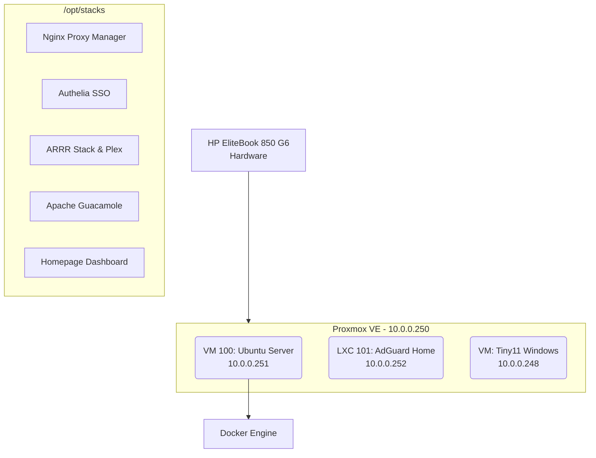
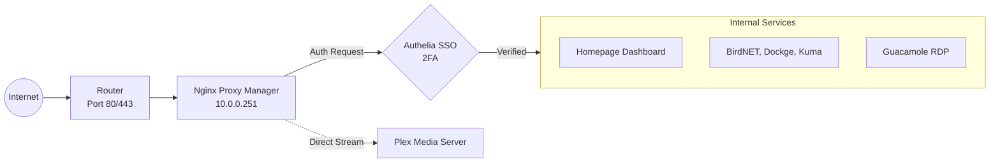

<div align="center">
  <h1>🏰 Valhalla Homelab</h1>
  <p><i>The central hub for infrastructure, media automation, and network management.</i></p>
</div>

---

> **Hardware**: HP EliteBook 850 G6 Laptop (Bare-Metal)  
> **Domain**: `valhalla-lab.duckdns.org`  
> **Gateway/Router**: `10.0.0.199`  
> **VPN**: Tailscale Subnet Router (`10.0.0.0/24`)

---

## 🏗️ 1. Architecture Overview

The homelab runs on a single bare-metal node managed by Proxmox VE. 



### The Nodes:
* **Valhalla (`10.0.0.250`)**: The bare-metal hypervisor running Proxmox VE. Handles all hardware resources.
* **Midgard (`10.0.0.251`)**: The heart of the homelab. An Ubuntu VM running Docker. All main applications (stacks) are containerized here inside `/opt/stacks`.
* **Heimdall (`10.0.0.252`)**: A lightweight LXC container running AdGuard Home for network-wide DNS filtering and ad-blocking.
* **Hugin (`10.0.0.248`)**: A heavily debloated Windows 11 (Tiny11) VM serving as a dedicated RDP workstation.

---

## 🌐 2. Network & Traffic Flow

Security is paramount. No services (except Plex direct play) are directly exposed to the internet without passing through SSO.



**How it works:**
1. Incoming traffic hits `valhalla-lab.duckdns.org` on ports 80/443.
2. Nginx Proxy Manager (NPM) terminates SSL and checks the requested subdomain.
3. For protected routes, NPM triggers a subrequest to **Authelia**.
4. If unauthenticated, the user is redirected to `auth.valhalla-lab.duckdns.org` for 2FA login.
5. Once authenticated, NPM proxies traffic to the correct Docker container.

---

## 🗂️ 3. Service & Endpoint Directory

> All external endpoints are protected by Authelia 2FA, except Plex which uses native auth.

### 🏠 Dashboards & Identity
| Service | External URL (HTTPS) | Internal (LAN) | Function |
| :--- | :--- | :--- | :--- |
| **Homepage** | [home.valhalla-lab.duckdns.org](https://home.valhalla-lab.duckdns.org) | `http://10.0.0.251:3008` | Central Dashboard (Auto-discovered via Docker Labels) |
| **Authelia** | [auth.valhalla-lab.duckdns.org](https://auth.valhalla-lab.duckdns.org) | `http://10.0.0.251:9091` | SSO Engine & Identity Provider |
| **NPM** | *(Internal Only)* | `http://10.0.0.251:81` | Reverse Proxy & SSL Certificates |

### 📺 Media & Entertainment
| Service | External URL (HTTPS) | Internal (LAN) | Function |
| :--- | :--- | :--- | :--- |
| **Plex** | [plex.valhalla-lab.duckdns.org](https://plex.valhalla-lab.duckdns.org) | `10.0.0.251:32400` | Media Server |
| **Overseerr** | *(Behind NPM)* | `http://10.0.0.251:5055` | Media Request Management |
| **Radarr** | *(Internal Only)* | `http://10.0.0.251:7878` | Movie Downloader/Manager |
| **Sonarr** | *(Internal Only)* | `http://10.0.0.251:8989` | TV Show Downloader/Manager |
| **SABnzbd** | *(Internal Only)* | `http://10.0.0.251:8085` | Usenet Download Client |
| **Prowlarr** | *(Internal Only)* | `http://10.0.0.251:9696` | Indexer Manager |
| **Tautulli** | [tautulli.valhalla-lab.duckdns.org](https://tautulli.valhalla-lab.duckdns.org) | `http://10.0.0.251:8181` | Plex Analytics |

### 🛠️ Infrastructure & Remote Access
| Service | External URL (HTTPS) | Internal (LAN) | Function |
| :--- | :--- | :--- | :--- |
| **Proxmox** | *(Internal Only)* | `https://10.0.0.250:8006` | Hypervisor Management |
| **Guacamole**| [rdp.valhalla-lab.duckdns.org](https://rdp.valhalla-lab.duckdns.org) | `http://10.0.0.251:8088` | HTML5 RDP Bridge to Tiny11 |
| **Dockge** | [dockge.valhalla-lab.duckdns.org](https://dockge.valhalla-lab.duckdns.org) | `http://10.0.0.251:5001` | Docker Compose Stack Manager |
| **Tailscale**| *(Cloud Admin)* | `bifroest` | VPN Subnet Router |
| **AdGuard** | *(Internal Only)* | `http://10.0.0.252` | Network-wide DNS Sinkhole |

### 📊 Monitoring & Utilities
| Service | External URL (HTTPS) | Internal (LAN) | Function |
| :--- | :--- | :--- | :--- |
| **BirdNET** | [birdnet.valhalla-lab.duckdns.org](https://birdnet.valhalla-lab.duckdns.org) | `http://10.0.0.251:8082` | AI Bird Song Classification |
| **Kuma** | [kuma.valhalla-lab.duckdns.org](https://kuma.valhalla-lab.duckdns.org) | `http://10.0.0.251:3001` | Uptime & System Monitoring |
| **Watchtower**| *(Headless)* | `http://10.0.0.251:8086` | Auto-Updater API |

---

## 🧠 4. Deep Dive: How the Systems Work

To ensure you can understand the system even after months of not touching it, here are the core mechanisms keeping the homelab running seamlessly.

### Docker Label Auto-Discovery (Homepage)
The central dashboard (`Homepage`) does not require manual configuration for every service. Instead, every `docker-compose.yml` file contains specific labels:
```yaml
labels:
  - "homepage.group=Media"
  - "homepage.name=Radarr"
  - "homepage.href=http://10.0.0.251:7878/"
```
When a container starts, Homepage automatically detects these labels and pins the service to the dashboard.

### Atomic Hardlinks (The ARRR Stack)
All media applications (Radarr, Sonarr, SABnzbd, Plex) share the exact same volume mount: `- /mnt/media:/mnt/media`.
* `/mnt/media/Downloads/usenet`
* `/mnt/media/MOVIES`
* `/mnt/media/TV`

Because the downloader (SABnzbd) and the managers (Radarr/Sonarr) see the *exact same filesystem structure*, they do not copy files when a download finishes. Instead, they create **hardlinks**. This means moving a 50GB movie from `Downloads` to `MOVIES` takes 0.1 seconds and uses 0 extra disk space.

### Guacamole RDP & Tiny11 Auto-Shutdown
`Guacamole` acts as a proxy translating standard RDP from the `Hugin` Tiny11 VM into HTML5/WebSockets, allowing you to control the VM directly in the browser via `rdp.valhalla-lab.duckdns.org`.
* **NPM WebSockets:** Guacamole requires WebSockets. In NPM, the `/websocket-tunnel` route explicitly disables `proxy_buffering` so the screen stream doesn't lag.
* **Auto-Shutdown:** To save RAM on Proxmox, the Tiny11 VM runs a Scheduled Task triggered by *RDP Disconnect* (which fires when you close the browser tab). It initiates a `shutdown /s /t 600` (10-minute timer). If you reconnect within 10 minutes, a second task `shutdown /a` aborts the shutdown.

---

## 🔑 5. Credentials & SSH Reference

| Node / Service | Username | Default Password / Auth | SSH Command / URL |
| :--- | :--- | :--- | :--- |
| **Midgard (Docker VM)** | `odin` | `[SECRET]` / SSH Key | `ssh odin@10.0.0.251` |
| **Valhalla (Proxmox)** | `root` | System Password | `ssh root@10.0.0.250` |
| **Heimdall (AdGuard)** | `root` | LXC Root Password | `ssh root@10.0.0.252` |
| **Hugin (Tiny11)** | `hugin` | Windows Password | *(Via Guacamole)* |
| **Guacamole Web** | `odin` | `valhalla` | *(Web Login)* |
| **Tailscale Portal** | Google/Microsoft | OAuth Login | [login.tailscale.com](https://login.tailscale.com) |
| **NPM Admin** | `admin@example.com` | `changeme` | `10.0.0.251:81` |

> **Passwordless SSH:** The Windows VM has an `ed25519` key loaded into Midgard's `~/.ssh/authorized_keys`, allowing the Antigravity IDE and VSCode to connect seamlessly without passwords.

---

## 🚀 6. Local Management Script (`homelab.ps1`)

If you are on a Windows machine in the LAN, you can use the interactive control center script to manage the entire stack, check port health, and launch SSH sessions with a single click.

```powershell
# Open a PowerShell window:
cd C:\Antigravity\HomeLab
.\homelab.ps1
```

*(You can also find this script at `/opt/stacks/homelab.ps1` on the server).*
